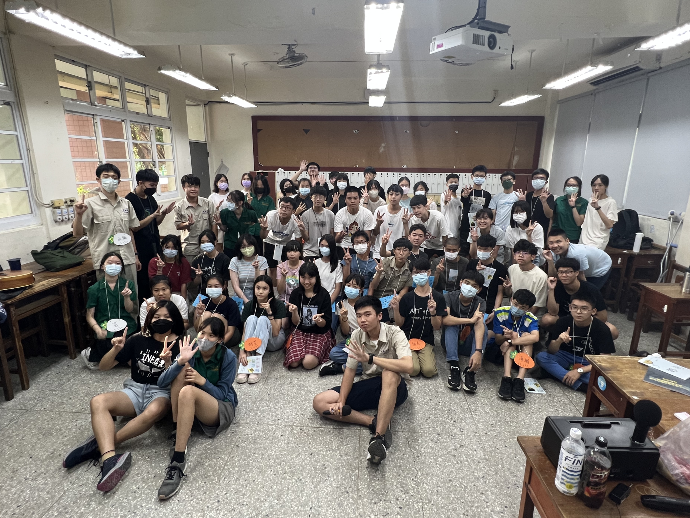
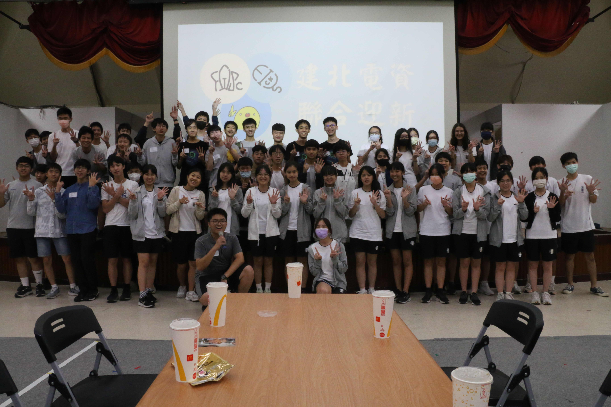
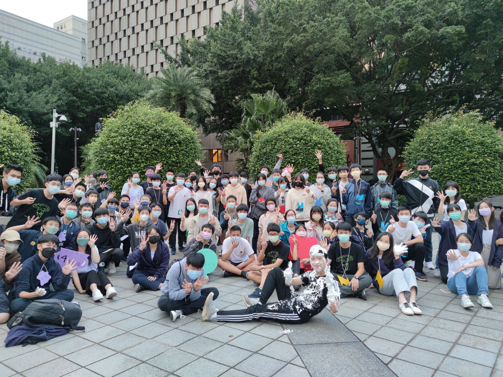
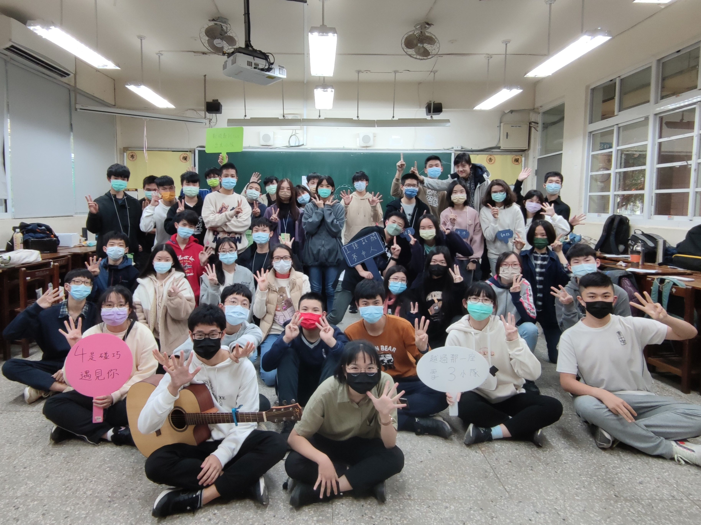
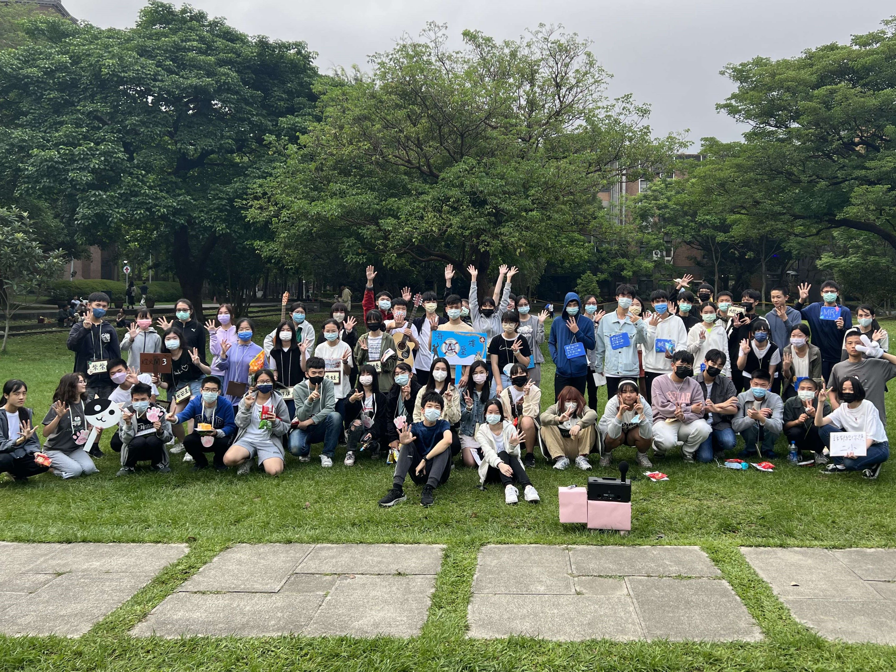
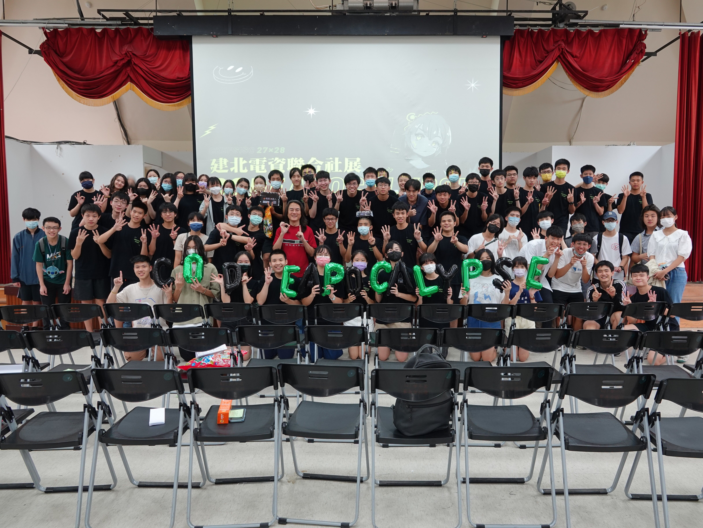

+++
date = '2024-10-31T10:06:48+08:00'
draft = false
title = '活動介紹'
+++

## 暑訓

舉辦時間：八月

建北電資聯合暑訓，簡稱暑訓。這個活動是幹部接幹後辦的第一個大型活動，更是附有讓學弟妹認識我們的任務。活動內教授基本資訊技能、程式語言等，也安排許多增進感情的活動。

## 迎新

舉辦時間：十月

加入社團，同屆們不見得有時間認識彼此，透過迎新，一定會對社團運作與身邊的朋友更了解的！這次也是學長姊認識學弟妹的一個好機會。

## 秋遊

舉辦時間：十～十一月

建北電資聯合秋遊，簡稱秋遊。秋遊是正式社員會參加的第一個活動。這個活動由秋烤演變而成，所以固定有烤肉行程，一起來炎上吧！

## 寒訓

舉辦時間：一～二月

建北電資聯合寒訓，簡稱寒訓。這將是學長姊們最後一個舉辦的大型活動，在寒訓間，會安排幾個神秘活動，到最後你一定會帶著感動的心回到溫暖的家中。

## 春遊

舉辦時間：四～五月

建北電資聯合春遊，簡稱春遊。這個活動是高一學弟妹的第一個任務，除了體驗幹部生活，也能與同屆增進感情。

## 社展

舉辦時間：六月

展中，我們將展現我們社團的學術力，發揮學術性社團的專長！
