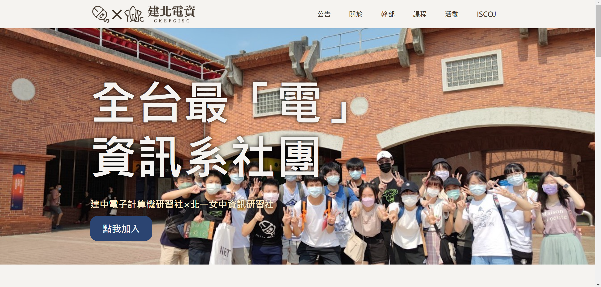
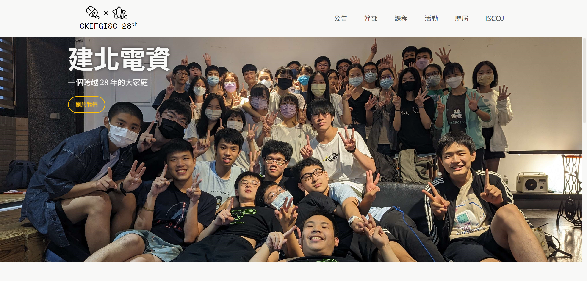
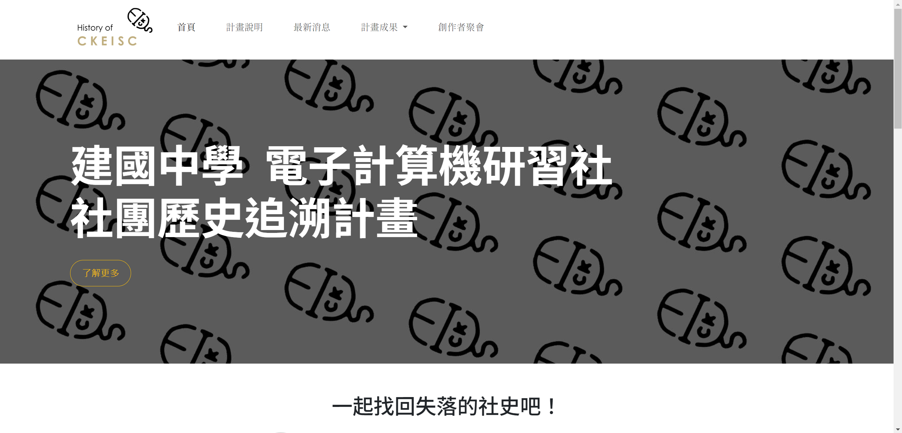
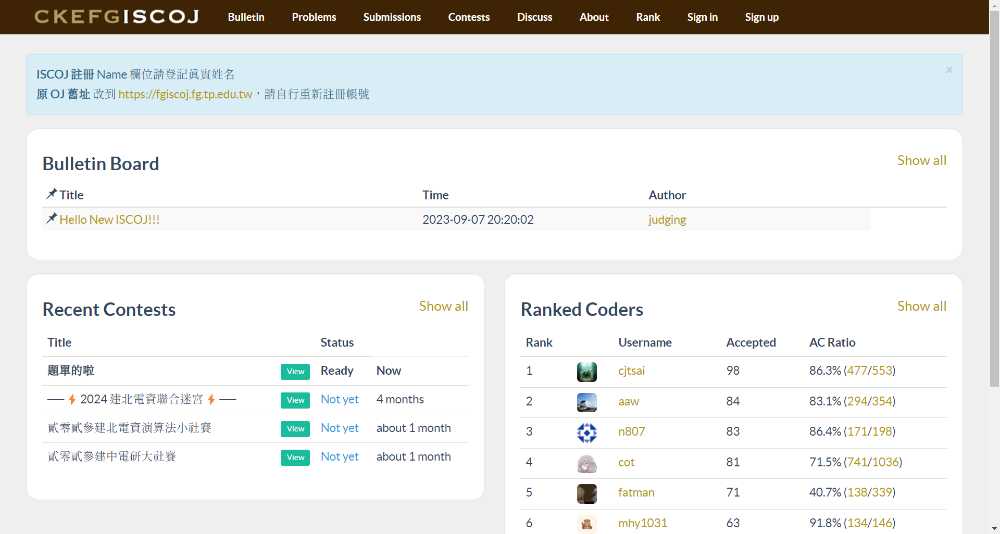

+++
date = '2024-10-31T09:54:50+08:00'
draft = false
title = '歷屆博物館'
+++

## 歷屆社網

### [27th 社網](https://27th.ckefgisc.org)

建北電資以往皆有架設網站作為招生及宣傳用途。但是自從建電社辦的伺服器被學校沒收之後，一直以來都找不到一個良好的網站架設環境，也沒有一個地方讓學術們統一放置教材供學弟妹使用。

因此，在一三接幹了之後，一二學術長檸檬便一直希望繼任的鹽亞倫可以將他們沒有做出的社網完成。 於是鹽亞倫便找了溫室菜以及北資學術長嗯嗯，嘗試從頭寫出一個網站，並且透過 Github Pages 進行架設。

### [28th 社網](https://28th.ckefgisc.org)

鹽亞倫大電神架好了 27th 社網，好強。接著換 28th 上幹了，網管 晴 決定重頭寫自己的社網。

雖然有學長姊的範本可以借鑑，不過因為他是笨，花了大半個暑假也沒有什麼進度。 不過在某一天意外學會了 React 之後，事情變得不同了。 有了進階網頁框架的強大功能，晴只需要把六哥寫好的前端網頁做成模板整理，接上 Router！於是 28th 社網就這麼誕生了……

## 其他網站

### [建電社史追朔網](https://history.ckeisc.org/)

### [ISCOJ](https://iscoj.fg.tp.edu.tw/)

建北電資的社員非常喜歡寫演算法題目，理所當然地我們有自己的線上評測系統，稱作 ISCOJ。不過 舊的 OJ 實在太難用了，於是 2023 AaW 和世宗架好了新的 OJ。

原本 UI 偏醜，但在網管 Ian 的努力下煥然一新，利用小黑推薦的 Nord 主題重新設定了配色。
