+++
date = '2024-10-31T10:07:10+08:00'
draft = false
title = '幹部介紹'
+++

## 建中電研

### 社長 - 無語

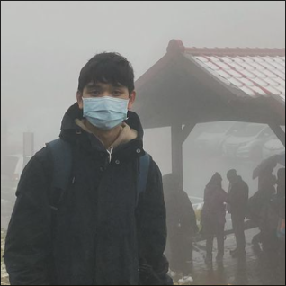

無語是個大忙人，上學期正辯論地電研攝影，下學期正電研地攝影，假日還要去中培，根本時間管理大師。

除此之外，他超會照顧別人，身上的背包簡直跟百寶袋沒兩樣，完全是個大暖男～

據說很常跟網管小黑做些不可理喻的事，搞得建電的人很躁，北資的人一直在嗑（？

### 副社長 & 學術 - 西瓜

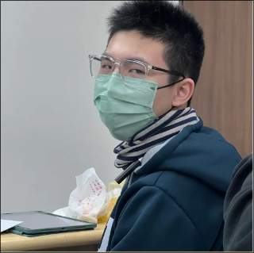

學術面幹時，學長給他的試講題目是逆向工程，於是西瓜就此和逆向工程日夜奮戰。

會在電腦上搞很多奇怪的東西，比如他暑訓籌備時曾經把 Ubuntu 魔改成 macOS、被一四學術長 807 推坑後在筆電上裝 NixOS等等。

講話超級機車，時常講出一針見血的吐槽。

可能是建電數一數二 E 的人，僅次於 Ian 跟 Sleepyboy。

### 學術長 - kea

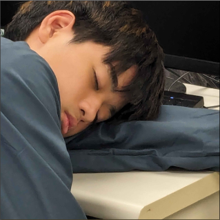

和上屆學術長不一樣，kea 參加了所有一四辦的活動，但很常因為一些原因消失。

競程超強，但除此以外的領域貌似都不太熟悉。不過聽說 kea 最近在學網頁跟 Swift，也許下學期會教除了演算法外的其他東西（？

除了程式超強外，kea 對排球也是略懂略懂，沒在寫扣的時間幾乎都在打排球，還上了排球副社。

### 學術 - Lucas

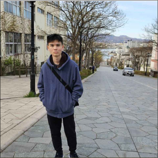

5 月考幹時同時考了資訊社跟電研的學術，結果上了資訊社的學術長、電研的學術 Orz。

Lucas 對 Python 一見鍾情，幾乎所有的 side project 都用 Python 寫。

市面上大部份的音遊 Lucas 都超強，世畫用拇指打紫譜輕鬆 FC，Arcaea 之流也不在話下。

最喜歡的動漫角色是美好世界的惠惠，據說就是因為這樣才被叫蘿莉控。

### 學術 & 總務 - 章魚

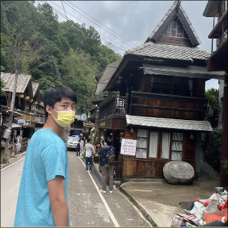

章魚是建電唯一的科班大佬，讓我們膜拜他 Orz Orz。

他多數時候都笑容滿面，貌似沒有什麼事能讓他傷心。

高一的每堂演算法小社課都有來，還在上機考第二階段電爛了 Ian。

### 學術 & 美宣 - Sleepyboy

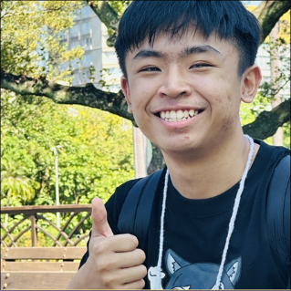

暑訓假案當關主時，Sleepyboy 一直跟來訪的小隊推坑快打旋風 6 和緋村劍心cc，漏講了一個重要線索，導致所有小隊推理全部歪樓。

跟上屆建電美宣 secant 很熟，所以才來考美宣，但繪畫功力實在難以讓人恭維...

幹話功力超強，跟 Ian 比有過之而無不及，之後應該會很常看到他拿著麥克風逼逼。

### 學術 & 網管 - Ian

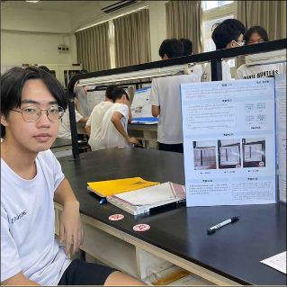

上知 HTML+CSS+JS，下知遊戲開發和競程，Ian 不但涉獵的領域極廣，並且皆造詣頗深。

不要以為 Ian 是個只會程式的陰沉死宅！他還會跆拳道、打藝，暑訓前甚至去考了紅十字會的急救員執照，只能說 Orz。

Ian 還是個社恐，全稱社交恐怖分子，他能跟在場任何人講幹話，有他在完全不會冷場。

### 網管 - 小黑

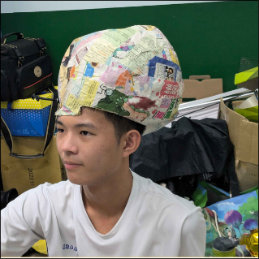

父親的綽號叫小黑，於是 Aaron Wu 就決定沿用這個綽號。但很不幸的，「小黑」兩個字被跟他同班的無良建電美宣硬是改成「黑奴」，從此這兩字就離不開他了。

這人不知道有啥毛病，喜歡在別人做出奇怪的行為時學義大利人🤌🤌。

很常在脆上面暴言，不過倒挺會吸流量的。

和副社西瓜一同堅持大括號換行，被建北電資幾乎所有人圍毆。

### 美宣 - 宇哲

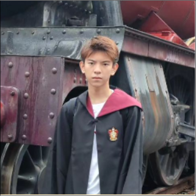

或許是以訛傳訛，或許是深藏不露，反正別人都說他很有錢。不只信義區的地契，還有專屬司機、小島、飛機等。

宇哲精通超級細胞家的遊戲，荒野 60000，皇室 7500，顯然是大佬。

承上，一天玩荒野亂鬥的時間足足有六個小時，時間到底從哪生出來的?

### 公關 - yen

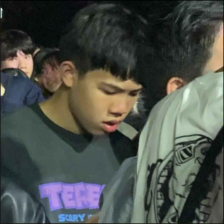

yen 寒訓的綽號是「火成岩」，但不知為何春遊時又改成 「yen 」，直接撞名一三建電文書兼網管 yen。於是其他人開始叫他小 yen，以和大 yen 區別。

他同時是科研的副教學長，所以平常都在忙科研，可能不會很常出現在社辦。

身為公關可能有點懶，頂多用社帳上去發建交限動和回訊息而已，但thread上都是網管小黑在留言。

### 公關 - 蕭生

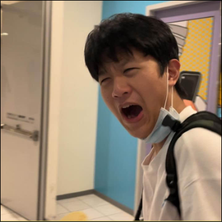

暑訓當隊輔時一天到晚找小隊員聊天，有時還搞不清楚自己在幹嘛，完全是沒付錢的小隊員（X

平常在建電話很少，但實際上比其他人想像中瘋癲許多。

據說會打瓦，也許可以找他切磋一下。

### 衛生 - 烏龜

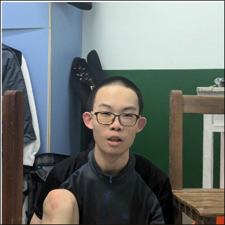

深藏不露，烏龜其實超級聰明，甚至還上了地理奧林匹亞的校隊 Orz。

一直留著清爽的平頭，不論春夏秋冬。

高一每堂小社課都會去，超級認真ww。

## 北一資研

### 社長 & 學術 - Pomelo

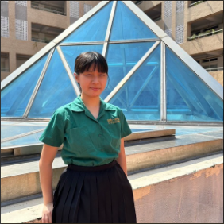

Pomelo 曾經在國文報告的 PPT 裡塞 C++ 的程式碼，好電 Orz

上課無敵認真，不睡覺也不滑手機，難怪成績這麼好。

貌似會做些迷惑行為，比如試圖讓筆支撐住魔術方塊（？

### 副社長 & 總務 - 影城

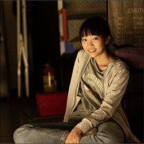

影城是新竹人，每次上下課都要搭高鐵來回，然後很常在最後一刻才搭上高鐵。

東西挺常不見的，包括但不限於春遊的 RPG 道具、學校發的回條、iPad 等等。

座右銘是「能躺著就不要站著，能躺著就不要坐著，能躺著就不要社交」。

### 學術長 - 點點

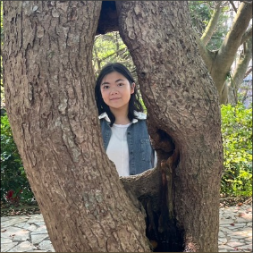

高一剛開學時裝的很好，大家對他印象都是很乖很可愛，不過據說點點超兇（？

家裡有超多小動物，貓咪鸚鵡狗蛇，根本動物園。

吃東西挺挑剔，堅持只吃切片的蛋。

### 學術 - Iris

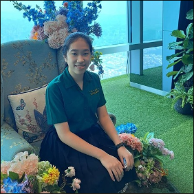

之前幾乎沒參加過建北電資活動的 Iris，靠著上機考時力壓眾人的 600 分上了學術，超鬼。

又一個新竹人，北資到底有幾個新竹人 ==

每次看到她名字都會想到鳶尾花資料集

### 學術 - 語雲

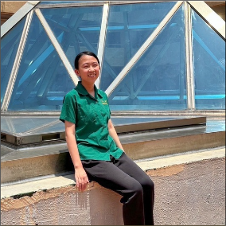

依本人所述，其實一開始想進數學研究社，只可惜北一沒有，陰錯陽差下才來了資研。

莫名其妙成了暑訓執秘，超級扛，做事超有效率，辦了一個很棒的暑訓。

行為很像小動物，暑訓場復時還躺在椅子上睡了兩個小時。

### 學術 - 貝絲

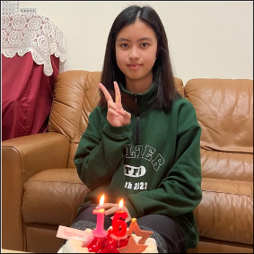

貝絲整天說自己很 i，但實際上超級 E，每次見面都說連假有一堆活動要參加，超級大騙紙。

被建電社長無語認真的亂源，很常搞些亂七八糟的事。

同時是機研的榮譽社員，因為機研不能雙幹所以只考北資的學術。

### 文書長 - 千特

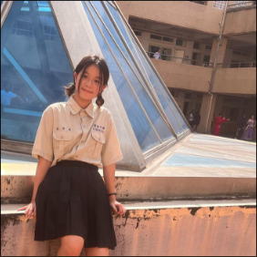

超級電神，除了程式以外的東西幾乎什麼都會- 舉凡畫畫、學業、羽球、瓦羅蘭、社交。

同屆沒有人考文書，於是千特就理所當然成了北資的文書獨苗。

畫畫超強，他甚至幫隔壁建電畫了社服。

### 公關 - 消波塊

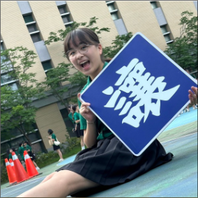

在參加暑訓前，小波就決定參加樂隊惹，但她又同時很喜歡資研，於是成了三幹人、樂隊的狗。

北資最社牛的人，沒有之一，極度瘋癲。

據說有打世界計畫和其他音遊。

### 公關 - 感冒膠囊

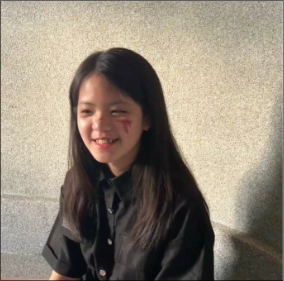

每次要她回訊息時，都得說「公主請回訊息」。

感冒膠囊雖然是公關，但其實挺 i（？。

人好看成績又好，根本人生勝利組。

### 網管 - 水母

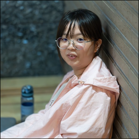

水母有著北資數一數二強的實力，是普通班中唯一進資訊能競二階的學生 Orz

一臉水母樣，所有才有水母這個綽號。

本人挺社恐的，但對熟人非常熱情。
